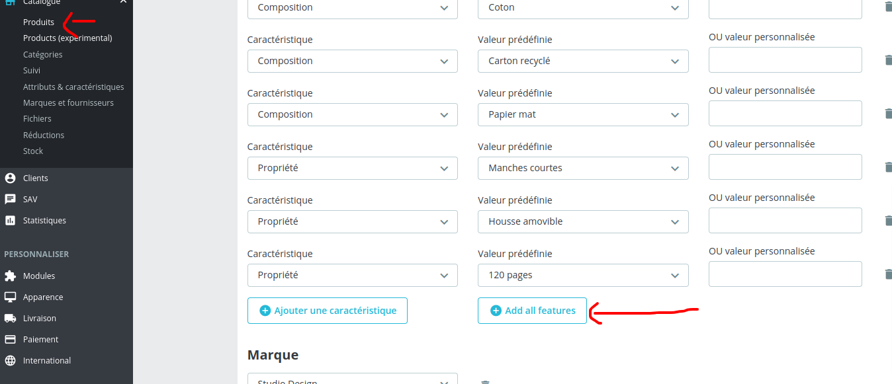

# prestashop-add-features
Prestashop module allow user to add all features to product with simple button click

## prestashop version 1.7

## install module 
 * go to back office product page
 * press btn add all features 
 * save 
### back office product page view 
 